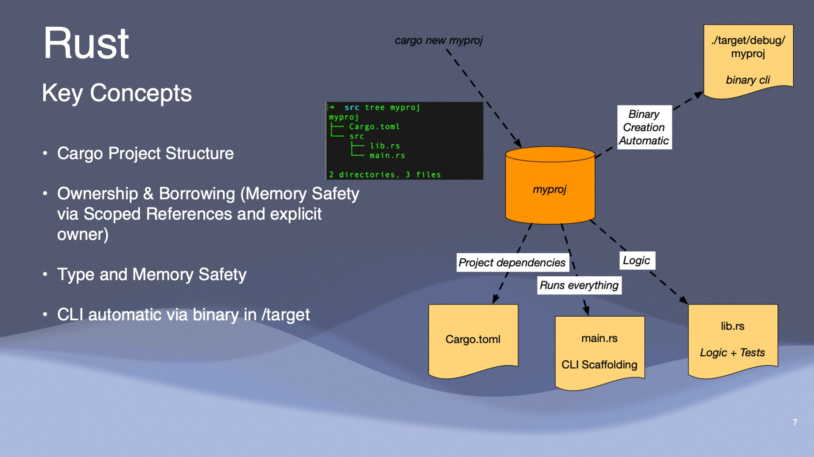

# Getting started

## Useful commands

- All `cargo` commands

## Packages
- [Rayon](https://docs.rs/crate/rayon/latest) - A data parallelism library for Rust

~~~rust
// Basic Rayon parallel map example  
use rayon::prelude::*;

fn main() {
  let vals = vec![1, 2, 3];
  let squared = vals.par_iter() // Rayon parallel iterator 
    .map(|x| x * x)  
    .collect::<Vec<_>>(); 
  
  println!("{:?}", squared);   
}
~~~

## Content of Week 1

- Overview of different AI Coding assistants (Bard, AWS Q (previously Whisperer), GitHub Copilot)
- Rust project structure
- Github actions
- Google Colabs & Simple GCP BigQuery SQL examples

## Resources

- [Harness AI Capabilities](https://github.com/readme/guides/coding-generative-ai)
- [Rust in MLOps](https://github.com/readme/guides/rust-mlops)

### Repositories
- [Rust MLOps Template](https://github.com/noahgift/rust-mlops-template)
- [Polars](https://github.com/pola-rs/polars/)
- [ONNX Runtime](https://github.com/microsoft/onnxruntime)
